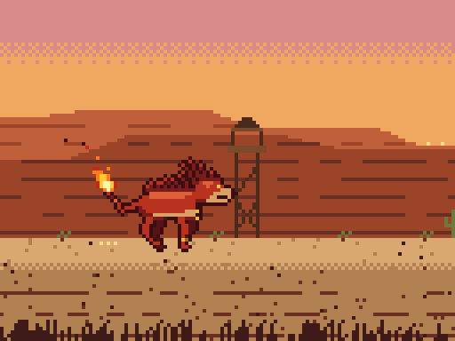
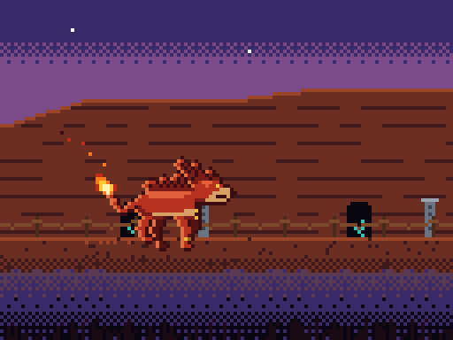
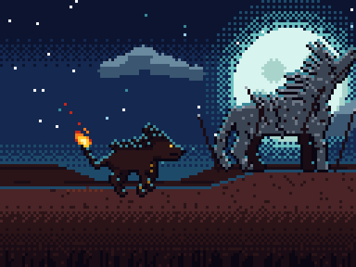
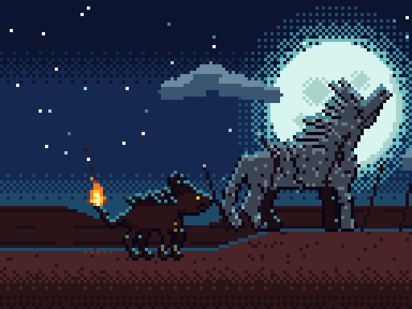

# Canyon Walk

A 99-second pixel-art short inspired by **Red XIII's** story in **Final Fantasy VII**. A young red-furred lion-wolf with a flaming tail climbs through a red-rock canyon, from late afternoon to dusk to full night, to reach his father. His father turned to stone defending the canyon and still stands on the summit under the full moon. The film is set to an orchestral cover of *Red XIII and Cosmo Canyon* and is staged like the "growing up" walk from *The Lion King*'s *Hakuna Matata*. Claude made it in Claude Code, with the audio prep done on Claude Sonnet 4.6 and the renderer on Claude Opus 5.5.

   

The hero and his father are **original characters**, drawn in the spirit of the game rather than as copies of Square Enix's designs, and the canyon is a generic red-rock setting rather than a recreation of Cosmo Canyon. The flaming tail was added on request during the session. Claude kept away from Red XIII's specific details, such as the numbered tattoo, the feather and the headdress.

## The song

*Red XIII's Theme* and *Cosmo Canyon* were composed by Nobuo Uematsu for Final Fantasy VII (Square, 1997). The audio comes from [Orchestral Fantasy's arrangement](https://www.youtube.com/watch?v=NxokTTdln-A), cut into three sections that match the three acts and joined with 1.5-second triangular crossfades:

| Act | Part of the track | Length | In the film |
|---|---|---|---|
| 1. Canyon floor | 0:00–0:29 | 29 s | 0:00–0:29 |
| 2. Cliffside ledge | 1:25–1:48 | 23 s | 0:29–0:50 |
| 3. The summit | 2:05–2:55 | 50 s | 0:50–1:39 |

The crossfades bring the total to 98.97 s. The second cut took five tries before it landed on the right phrase (126–146 s, 66–86 s, then 85–105, 85–106 and 85–107 s before 85–108 s).

## How it was made

**Everything in this repository was written by the model.** The direction, in order:

1. **Template.** A shot-by-shot breakdown of the *Hakuna Matata* walk (a locked side-on camera, a foreground blur layer, a single ledge to walk along, three environments, the hero growing up across the cuts, and the moon as the climax) was pasted in and saved as [`hakuna-matata-walk-analysis.md`](hakuna-matata-walk-analysis.md). The reference clip came from an earlier session in the same folder and isn't included in this repo.
2. **Soundtrack (Sonnet 4.6).** *"download https://www.youtube.com/watch?v=NxokTTdln-A… save as red-xiii-theme"*, then three sections were sampled from it and joined. The first join was a hard cut: *"they don't quite match up so can we add a quick cross fade to help ease the transtion between each sequence?"*
3. **Style (Opus 5.5 from here on).** *"The style of the video is going to be retro pixels"*, with a pixel-art wizard-under-the-moon image as the reference. Claude checked the existing [`animation-style-hints.md`](animation-style-hints.md) against it and listed what was missing: dithered skies, a ground plane, stars, parallax and the three-act structure.
4. **Story.** *"Red XIII is walking through Cosmo Canyon going to see his dad that sacrificed his life and still stands as a statue under the full moon (the climax and end of the video…)"* with the backgrounds changing *"at the times that match the lengths of the first 2 sequence mp3 files."* Claude rewrote the hints file as a full spec. It timed the scene changes to the audio crossfades and not the raw clip lengths, and it described the hero and father as original characters. The next request added *"a flaming tail… which should have it's own flame effect as the character walks."*
5. **Build.** *"build the renderer and generate the mp4"*. Claude checked still frames from each act before rendering the whole film and lowered the cliffs in act 2, which were hiding the dusk sky.
6. **Polish.** *"yeah fix the rough spots. Also don't fade out at the end leave the last frame showing the father and son staring at the moon."* The statue, which had been the hero's sprite scaled up 1.3×, was redrawn by hand at full resolution. The hero's four legs got separated into near and far pairs. The fade to black was removed, and the moon and statue were moved so the film ends on both of them gazing up.

## What it cost

The work was one Claude Code session that switched models partway through. Priced at [Anthropic API rates](https://www.anthropic.com/pricing#api), with token counts from the usage logged in the session transcript, getting from the first request to the final video would have cost about **$4.40**:

| | Tokens | Price per million | Cost |
|---|---|---|---|
| **Claude Opus 5.5** (style, spec, renderer, video; 27 model calls) | | | **$3.74** |
| Output, including thinking | 99.6K | $20 | $1.99 |
| Cache writes (1-hour TTL) | 120K | $8 | $0.96 |
| Cache reads | 3.93M | $0.20 | $0.79 |
| **Claude Sonnet 4.6** (download, cutting, crossfades; 34 model calls) | | | **$0.66** |
| Cache reads | 1.45M | $0.30 | $0.44 |
| Cache writes (1-hour TTL) | 24K | $6 | $0.14 |
| Output | 5.5K | $15 | $0.08 |
| **Total** | | | **~$4.40** |

- Those figures run up to the start of this README step. Packaging it as a repo adds a little more. An earlier short session in the same folder, on Sonnet 4.6, adds about $0.53.
- Most of the saving comes from prompt caching. At the full input rate, the 5.4M re-read tokens would have cost about $20 on their own.
- Uncached input was under 200 tokens, which rounds to $0. The rendering ran locally with Node and ffmpeg, so it cost nothing.
- These are estimates from logged usage, not an invoice. On a Claude Pro or Max plan, Claude Code isn't billed per token.

## The renderer

[`renderer.js`](renderer.js) has no dependencies. Every frame is a pure function of time `t`, drawn as palette indices into a 128×96 buffer. It uses a fixed palette of 48 colours and no anti-aliasing, gradients or blur, and every coordinate snaps to the pixel grid.

- **Timeline:** act changes are 1.5 s dithered dissolves, centred on the audio crossfades (27.53–29.03 s and 49.02–50.52 s). Each pixel switches through a 4×4 Bayer threshold rather than an alpha blend, so the palette stays pure.
- **Staging:** the camera is locked side-on and the hero walks in place while five parallax layers scroll past: sky, far mesas (0.1×), mid cliffs and props (0.35×), the ground ledge (1×) and dark foreground rock and grass (1.6×). The walk cycle is tied to the distance scrolled, so the paws don't slide.
- **Hero:** the body is drawn from a pixel grid. The legs, spiky crest, tail and bead necklace are driven by parameters and then snapped to the pixel grid, with the pose updating at 10 fps to give a sprite feel. The crest and beads lag the body slightly.
- **Tail flame:** it has its own four-colour ramp and a 12 fps flicker built from layered sine waves. It leans against the tail's motion and trails backward like a carried torch. Embers drift off it, calculated from `t` alone with no stored state. It casts a dithered warm glow on the fur and the ground, and it settles to a slow, tall flame once he stops.
- **Act 1, canyon floor at sunset:** layered mesas, cliff dwellings with ladders and walkways, watch-posts, flickering bonfires with embers, scrub and cacti.
- **Act 2, cliffside ledge at dusk:** a narrow rock ledge above a dark drop, rope railings, cave mouths with a faint teal glow, stone totems, and the first stars. The hero gets an orange rim light from the setting sun behind him.
- **Act 3, the summit:** a teal night sky with twinkling stars, a large moon with crater blotches and dithered halo rings, rising over the first 12 s, and drifting clouds. The hero fades into a silhouette whose only warm colours are the flame and his eyes. His father's statue, drawn by hand in stone with a heavy mane, raised muzzle, cracks and broken spears, scrolls in on a rock spur. The walk slows to a stop at 88 s, the camera tilts up through the parallax layers, the hero raises his head, and the last frame holds.

[`render-video.js`](render-video.js) streams 2,970 frames at 30 fps into ffmpeg, scales them up 10× with nearest-neighbour to 1280×960, encodes them as H.264 and adds the soundtrack as AAC. A full render takes about 8 seconds.

## What's here

| Path | What it is |
|---|---|
| [`renderer.js`](renderer.js) | The whole film: palette, timeline, hero, flame, statue and all three environments. It also loads in a browser as `window.CanyonRenderer`. |
| [`render-video.js`](render-video.js) | Renders the MP4s, or single frames for checking |
| [`fetch-audio.sh`](fetch-audio.sh) | Downloads the cover and rebuilds the three cuts and the crossfaded soundtrack |
| [`animation-style-hints.md`](animation-style-hints.md) | The spec the renderer was built from |
| [`hakuna-matata-walk-analysis.md`](hakuna-matata-walk-analysis.md) | Breakdown of the reference walk the structure is based on |
| [`docs/`](docs/) | Frames from each act, used above |

## Running it

You need Node.js (tested on 24), ffmpeg and yt-dlp.

```bash
./fetch-audio.sh                          # download the cover → combined-sequences-1.mp3
node render-video.js                      # → canyon-walk.mp4 and canyon-walk-with-music.mp4
node render-video.js --stills 20,40,92    # single frames at 4× → stills/t-20.png, …
```

Only the last step of the render needs the audio. Without it, `canyon-walk.mp4` (silent) still renders, and the step that adds the music fails.

## Credits

- *Red XIII's Theme* and *Cosmo Canyon* by Nobuo Uematsu. Final Fantasy VII © Square Enix. Red XIII is a Square Enix character. The characters in this film are original designs inspired by him.
- Orchestral arrangement: [Orchestral Fantasy](https://www.youtube.com/channel/UCZ7uHvfPDJH1xrD2sVViWqg), [*Final Fantasy 7 - Red XIII and Cosmo Canyon*](https://www.youtube.com/watch?v=NxokTTdln-A).
- Structural reference: the *Hakuna Matata* sequence from *The Lion King* (Disney, 1994).
- Tools: [ffmpeg](https://ffmpeg.org/), [yt-dlp](https://github.com/yt-dlp/yt-dlp).

## License

The code is [MIT](LICENSE). The music and the recording belong to their owners (see Credits) and aren't covered by that license. They aren't in the repo; `./fetch-audio.sh` downloads and cuts them. The reference images used during the session (a Red XIII portrait, a key-art image of the father scene, and a pixel-art example) aren't included either.
